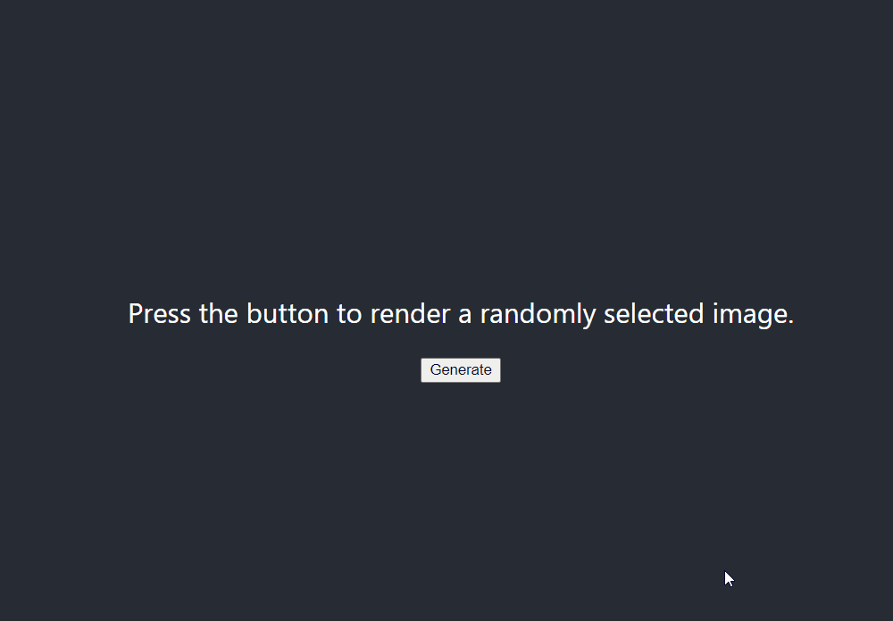

# CS361: Assignment 2: Microservices Warm-Up

<b> Overview </b>
To demonstrate you can implement the microservices architecture, write software comprised of three separate programs:

1. A program that generates pseudo-random numbers (PRNG Service)
2. A program that, given a non-negative integer i, returns the ith image in a set (order doesn’t matter) (Image Service)
   • If i is >= the number of images, modulo i by the size of the image set
3. A user interface (UI) that either has a button or can receive a user command. When the button is pushed or the command is entered...
   (a) UI calls the PRNG Service
   (b) UI calls the Image Service using the pseudo-random number from the PRNG Service
   (c) UI displays the image (or a path to it)

Programs can be written in any language(s).

Use any set of images (e.g., downloaded from https://www.kaggle.com/). Store images locally in a folder; no API calls needed. No DB needed.

<b> Requirements </b>
• UI must either have a button (if UI is graphical) or be able to receive a user command (if UI is text-based)
• Each of the three programs must run in a different process
• Programs must NOT call each other directly (e.g., do not import one program into another)
• As the communication pipe, use text files as follows:

1. UI calls PRNG Service by writing the word "run" to prng-service.txt
2. PRNG Service reads prng-service.txt, erases it, and writes a pseudo-random number to it
3. UI reads prng-service.txt to get the pseudo-random number

4. UI writes the pseudo-random number to image-service.txt
5. Image Service reads image-service.txt, erases it, and writes an image path to it
6. UI reads image-service.txt then displays the image (or path) to the user
   • Create a short video (5 minutes or less) demonstrating you have satisfied the require- ments.

<b> Submission </b>
Submit a link to your video.

There are two options for recording/uploading your video:

1. Record and upload following the instructions in Canvas > “Start Here - ReadMe First” > HOW TO: Create and Upload a Video
   OR
2. Record using the technique of your choice, upload to YouTube, set as Unlisted
